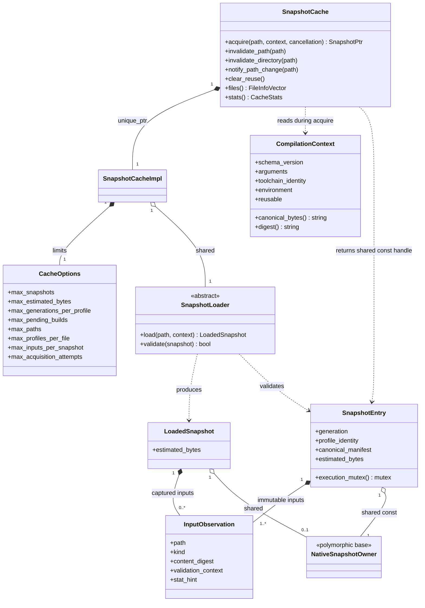
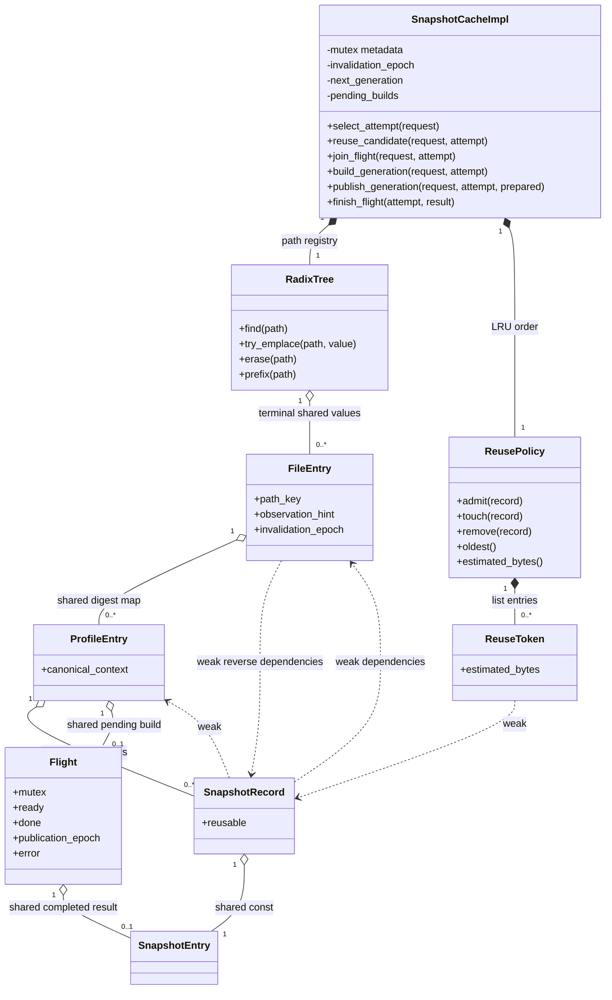
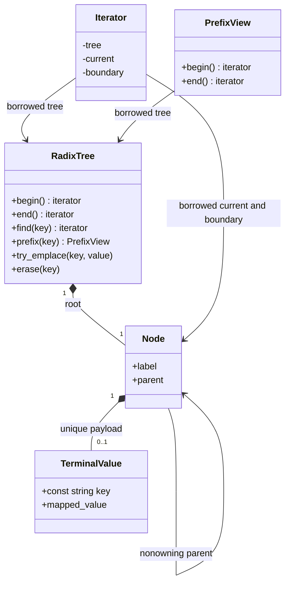
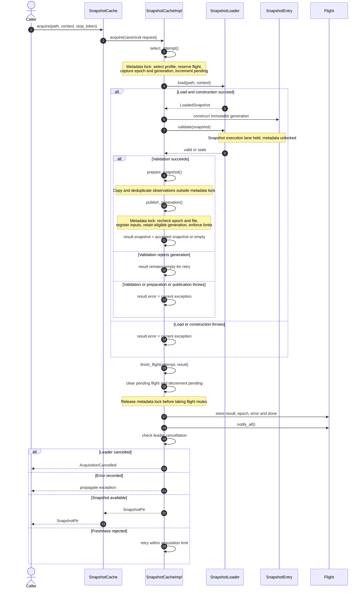
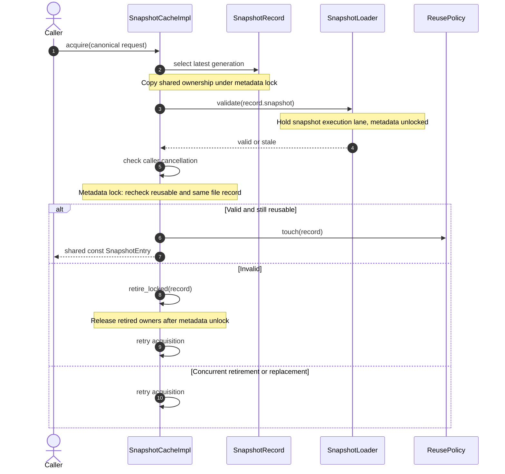
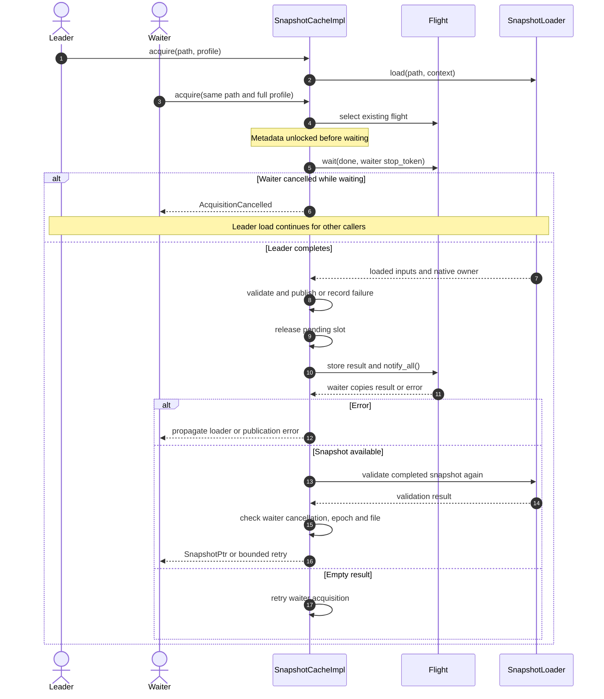
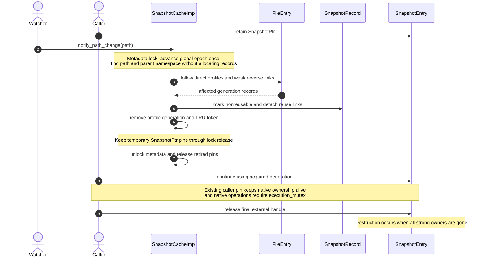

# Clang Toolkit C++ Technical Design

This document describes the C++ server at commit `5702f26` and explains the implemented snapshot cache through UML class and sequence diagrams. The cache separates path metadata, reusable generations and immutable native ownership so that invalidation can prevent reuse while callers continue using snapshots they already acquired.

## Scope and implementation status

The server builds as C++23. `ctk_core` contains the cache and the transport, scripting and storage interfaces. Optional `ctk_clang` contains the Clang boundary, and `ctk-server` currently starts the transport scaffold. Only `server/src/clang/` includes Clang or LLVM headers.

| Module | Current behavior | Remaining integration |
| --- | --- | --- |
| `ctk::cache` | Radix path registry, canonical compilation identity, immutable snapshots, shared acquisition, validation, invalidation and bounded reuse | Production native loader and callers |
| `ctk::net::Server` | Stores an address; `run()` prints a message and returns | gRPC dispatch, UDS and TLS serving |
| `ctk::script::Engine` | `eval()` returns its source unchanged | Query composition and evaluation |
| `ctk::storage::Store` | Abstract `load()` and `save()` contract | Filesystem and SQLite implementation |
| `ctk::clang_layer` | `Project` and free functions for match, CFG and call graph; functions return empty results | Native parsing and query execution |

The earlier wiki architecture and cache pages describe the intended system; their C++20 and cache status statements predate this implementation. Cursor registries, binding rows, persistence and transport orchestration are future integration work and are not represented as existing cache calls below. The older generic `LruCache` is separate from snapshot retention.

## UML class diagrams

Class names below omit their namespace for readability. Public cache types are in `ctk::cache`; internal records and reuse policy are in `ctk::cache::detail`. `SnapshotCacheImpl` denotes the private `SnapshotCache::Impl` class.

A filled diamond means exclusive containment. An open diamond labeled `shared` means a strong shared pointer that extends lifetime. A dashed arrow labeled `weak` means a non-owning weak pointer. A plain arrow denotes use or a borrowed reference. Multiplicities describe objects retained by each source object.

### Public cache boundary

`SnapshotPtr` is `std::shared_ptr<const SnapshotEntry>`. A caller retaining that handle pins the generation and its native owner independently of cache reuse. The class enforces immutable snapshot fields; its execution mutex serializes native operations because immutable ownership alone does not make a native AST thread safe. `LoadedSnapshot` is a transfer record, rather than a base class of `SnapshotEntry`.

`SnapshotLoader` supplies a stable native owner and a complete manifest of consumed file buffers, absent lookup candidates and relevant directory observations. It must validate content and lookup state; stat hints alone cannot establish freshness. The cache holds the execution mutex during `validate()`, so the adapter must not acquire that mutex again. Loads and validation of different snapshots can run concurrently. A production Clang implementation of these interfaces has not yet been supplied.

### Metadata and reuse ownership

The radix tree is the sole authoritative pathname registry. A file record can represent a main source, a dependency, an absent candidate or a directory namespace. Its observation hint is advisory; the snapshot manifest remains the authoritative record of the captured generation. Profile lookup uses a digest but compares the complete canonical context before reuse. A digest collision or `reusable=false` bypasses profile reuse and builds an ephemeral snapshot.

The profile owns reusable generation records. The LRU contains weak tokens and byte estimates, rather than another pathname index or native owners. Weak links in both dependency directions avoid ownership cycles. Retirement removes generation ownership, reverse membership and the LRU token; it does not invalidate an already acquired `SnapshotPtr`.

### Radix container structure

`TerminalValue`, `Iterator` and `PrefixView` are diagram labels for the template's payload, iterator and prefix range types. The payload is `std::pair<const std::string, T>`. Compressed labels and children ordered by unsigned initial byte support lexicographic forward traversal. A terminal may also have children; the root label is empty. Prefix matching can end inside a compressed label.

Structural mutation or moving the tree invalidates iterators and views. References to surviving payloads remain stable across splits, merges and moves; erasing a payload ends its lifetime. The container has no internal locking. The cache serializes traversal and mutation under its metadata mutex and exposes copied `FileInfo` vectors to callers. Immutable keys and forward traversal support lookup, filtering and transformation, but not sorting or other algorithms requiring permutable keys or random access.

## Identity and resource policy

Paths use explicit absolute POSIX server spellings. Relative paths, NUL, dot components and repeated separators are rejected. A single trailing slash is accepted and removed, except for `/`. The cache does not resolve symlinks or fold case. Directory invalidation includes the exact namespace and descendants under a separator boundary, so `/src` does not match `/src-old`.

The versioned compilation identity captures input spelling, working directory, ordered arguments, toolchain and resource identities, target, sysroot, ordered overlays and environment entries sorted by name. Canonical UTF-8 JSON and full-byte equality determine compatibility. The ordered input manifest has a separate canonical representation and excludes stat hints.

Limits independently bound reusable generations, estimated reusable bytes, generations per profile, pending builds, path records, profiles per file, input observations and acquisition attempts. Oversized snapshots and zero reuse capacity can return valid ephemeral handles. External pins and native parsing allocations remain outside the reusable byte estimate. Capacity failures raise `ResourceExhausted`; repeated freshness rejection ends with an acquisition error after the configured retry bound.

## UML sequence diagrams

These diagrams describe cache calls that exist in the current source. Metadata lock notes refer to `SnapshotCache::Impl::mutex`. Slow native work, waiting and native-owner destruction occur outside that lock. Methods ending in `_locked` require a caller-held metadata lock.

### Cold acquisition and publication

The initiating caller performs the synchronous load. Its stop token is checked after completing the flight, so cancellation can still leave a reusable generation for other callers. A load or publication exception is recorded for joined waiters, and every completed build releases its pending slot. Publication and completed-flight reuse conservatively require the global epoch to match, covering dependencies discovered during parsing; unrelated invalidation can therefore cause a bounded retry.

### Warm reuse

Warm acquisition uses the record's reuse state and file identity after validation. It does not reject a generation solely because an unrelated global invalidation epoch changed. Relevant invalidation reaches the record through its registered dependency links.

### Joining a build and independent cancellation

A waiter joins the existing full-identity flight before any new pending-build slot is reserved, including when the build limit has been reached. Waiter cancellation affects that waiter only. Each waiter revalidates a completed snapshot before returning it; a flight result is not a guarantee that disk state stayed unchanged until the waiter resumed.

### Dependency invalidation and pinned lifetime

Explicit path invalidation follows the same retirement policy. Directory invalidation visits the exact namespace and descendant paths, and reverse dependencies can retire a translation unit outside that directory. Eviction retires reuse ownership using the same lifetime discipline without being a watcher event. An unused path record cannot be erased while reusable generations, flights or live reverse dependencies still require it. Cache destruction requires all active cache operations to have finished.

## Implementation organization and validation

`SnapshotCache::acquire()` prepares identity and delegates. `snapshot_acquisition.cpp` separates retry coordination, selection, warm validation, flight waiting, native load, publication and completion into short named methods. `acquisition.hpp` carries request, attempt and prepared-result records. `cache_state.cpp` contains metadata policy. Keeping these responsibilities separate makes locking and owner lifetime visible without a multi-page acquisition function.

The recorded post-refactor checks pass 52 C++ tests in macOS `dev`, macOS `dev-noclang` and Rocky Linux 9, plus 92 Python tests on macOS and Rocky Linux. Coverage includes radix split and merge behavior, identity collisions, reverse invalidation, publication races, cancellation, metadata pressure, eviction with external pins and native destruction outside metadata locking. These are the existing implementation results; this document adds no production parser or transport implementation.

## Source references

| Source | Design evidence |
| --- | --- |
| [Cache contract](/Users/husam/workspace/clang-toolkit/docs/cache.md) | Identity, ownership, container and concurrency rules |
| [Public cache API](/Users/husam/workspace/clang-toolkit/server/include/ctk/cache/snapshot_cache.hpp) | Acquisition, invalidation, inspection and limits |
| [Snapshot boundary](/Users/husam/workspace/clang-toolkit/server/include/ctk/cache/snapshot.hpp) | Immutable snapshot, observations and loader contract |
| [Metadata records](/Users/husam/workspace/clang-toolkit/server/include/ctk/cache/cache_records.hpp) | Strong and weak ownership relationships |
| [Radix tree](/Users/husam/workspace/clang-toolkit/server/include/ctk/cache/radix_tree.hpp) | Compressed nodes, iterators and prefix ranges |
| [Acquisition phases](/Users/husam/workspace/clang-toolkit/server/src/cache/snapshot_acquisition.cpp) | Cold, warm, waiter and cancellation sequences |
| [Cache state policy](/Users/husam/workspace/clang-toolkit/server/src/cache/cache_state.cpp) | Publication eligibility, retirement and limits |
| [Reuse policy](/Users/husam/workspace/clang-toolkit/server/include/ctk/cache/reuse_policy.hpp) | Weak LRU tokens |
| [Validation record](/Users/husam/workspace/clang-toolkit/docs/cache-implementation-progress.md) | Existing build and test results |
| [Server architecture design](https://chatgpt.com/space/page_1abde7a65a14819196b0919a6311a5ba) | Intended integration; wiki mirror `[[pages/planning/clang-toolkit-server-architecture]]` |
| [Original cache design](https://chatgpt.com/space/page_2e571754ca3081919967899081ebaf73) | Design rationale; wiki mirror `[[pages/planning/clang-toolkit-ast-cache]]` |
| [Radix and binding design](https://chatgpt.com/space/page_77f518388f748191b08749f838b780fa) | Path registry rationale; wiki mirror `[[pages/planning/clang-toolkit-radix-binding-model]]` |
