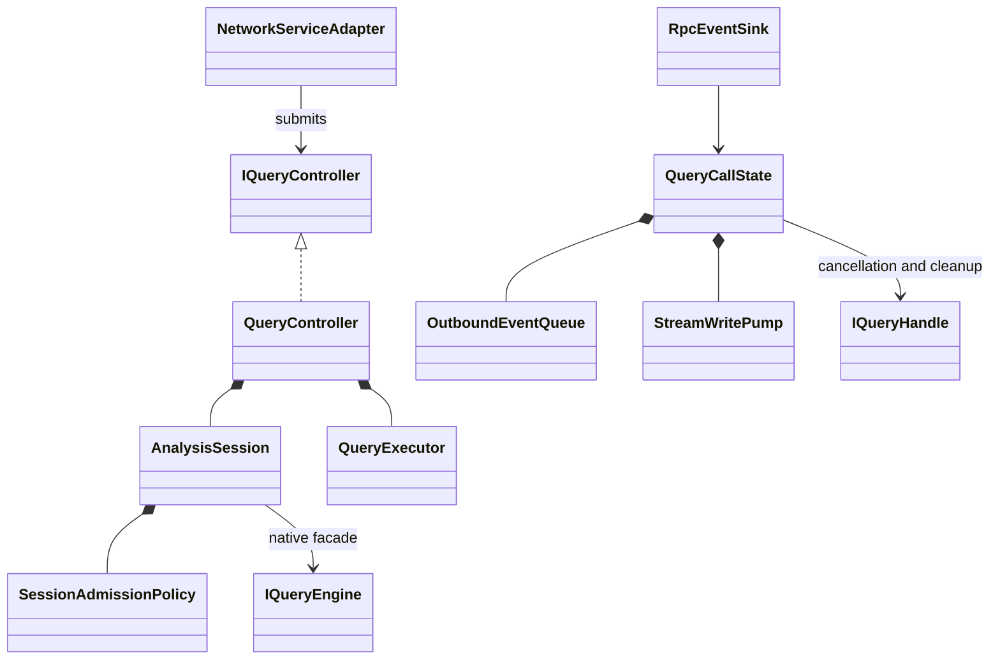
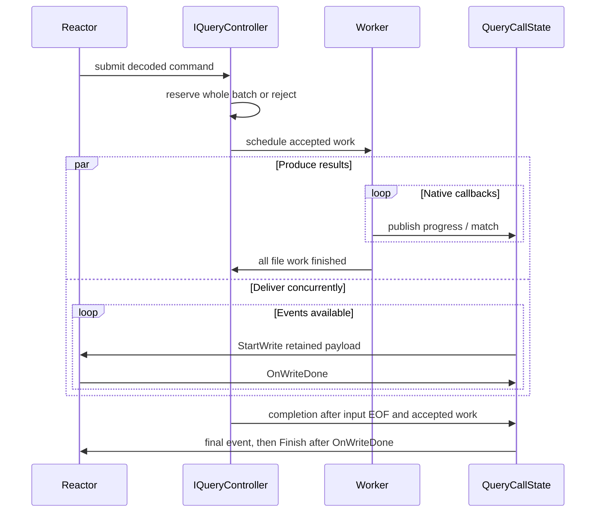

# Network implementation progress

Source: [Clang Toolkit Network Layer Design](https://chatgpt.com/space/page_561b779557cc8191a5aace9bf6273191), read at revision 42 and corrected/read back at revision 43 on 2026-10-05.

- [x] Read live design, wiki and project instructions; record unrelated storage changes.
- [x] Define additive protobuf streaming contract and Clang-free controller boundary.
- [x] Shared configuration discovery, merge, validation and endpoint resolution.
- [x] Application admission, execution, retained ownership and cancellation.
- [x] Native callback transport and concurrent event delivery.
- [x] Async Python client and foreground/background/bidirectional CLI.
- [x] C++/Python/BDD integration checks and lifecycle review.

## Policy corrections

Accepted work continues under budget pressure and slow delivery; producers never
wait for network capacity. An outgoing memory queue holds 64 events; overflow is
spooled on application workers, preserving matches while writes proceed concurrently.
The shared overhead allowance has its own violation name,
`session.overhead_memory_bytes`, with current usage and projected usage.
The adapter submits only through `IQueryController`; the controller admits and schedules.

## Implementation boundaries and estimates

The additive `ctk.query.v1.QueryService` contract streams direct semantic binding
summaries (`kind`, `name`, `type`). It does not claim the complete recursive semantic
serializer specified separately by `ctk.match.v1.MatchService`.

The controller plans 16 MiB retained/native memory for each new main-file/profile
input and 16 MiB temporary parsing memory for each admitted profile task, including
existing profiles. It reconciles native counters after work
and reserves 33 MiB shared overhead per live stream for its 64 memory slots and
in-flight message. Stream overhead remains reserved until transport cleanup.
These estimates are explicit admission planning values, not source-file sizes or
hard native allocation limits. Native counters are partial; actual parse memory
can exceed an estimate without cancelling or pausing accepted work.

An application endpoint lease prevents a second server from replacing a live Unix
socket or sharing its TCP port. Native locking is confined to `platform/`; gRPC
still owns socket creation, binding, unlink handling and transport lifecycle.

## Verified results

- macOS/Homebrew Clang 22.1.8: `dev` CTest 96/96 and `dev-noclang` CTest 92/92.
- macOS Python: 125/125, including six live network BDD scenarios; no skipped tests.
- Rocky Linux 9/Clang 21.1.8 container: CTest 96/96 and Python 125/125; no skipped tests.
- Live terminal check: help remains responsive while a background query produces a native match.
- Native tests cover standard-library headers, malformed input, header edits and equal-size edits with preserved timestamps.
- Transport tests cover ordered overflow delivery, cancellation, late producer callbacks, duplicate endpoint ownership and shutdown without client half-close.
- Application review found no remaining high-confidence blockers in admission, ownership, callback cleanup or retained-memory accounting.
- Ruff and `git diff --check` pass.

Rocky compatibility required a SQLite target alias and one explicit `int64_t`
conversion at an existing storage binding. Other pre-existing storage changes were
preserved. The older AST-schema checker (`uv run python api/check.py`) still fails
on the unchanged `DeclarationValue.node` generic wrapper; the additive query
protobuf contract generates and builds on both platforms.

Native reuse is conservative: simple main-only profiles require exact consumed-byte
validation; preprocessing, headers, modules and PCH profiles rebuild. Production
Cache/Store adapters and the complete recursive AST serializer remain separate
integration work, as described in [network.md](network.md#scope).

Related wiki sources: [[pages/planning/clang-toolkit-network-yaml-configuration]],
[[pages/planning/clang-toolkit-bidirectional-query-session]],
[[pages/research/clang-toolkit-session-file-memory-limits]].

